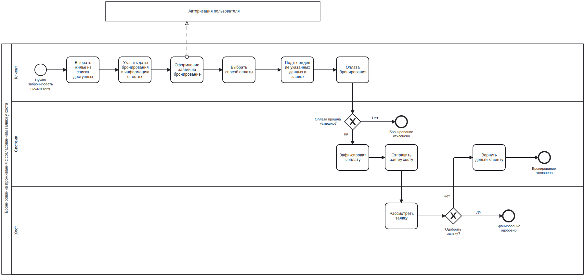

# БЛПС. Лабораторный курс

---

Группа:

- Кузьмин Артемий Андреевич
- Силинцев Владислав Витальевич

## Лабораторная работа 1

Вариант: 2606

Airbnb — жильё для отпуска, домики, пляжные дома и многое другое — [https://www.airbnb.ru/](https://www.airbnb.ru/). Бизнес-процесс: бронирование проживания с согласованием заявки у хоста.

Описать бизнес-процесс в соответствии с нотацией BPMN 2.0, после чего реализовать его в виде приложения на базе Spring Boot.

### Порядок выполнения работы

1. Выбрать один из бизнес-процессов, реализуемых сайтом из варианта задания.
2. Утвердить выбранный бизнес-процесс у преподавателя.
3. Специфицировать модель реализуемого бизнес-процесса в соответствии с требованиями **BPMN 2.0**.
4. Разработать приложение на базе **Spring Boot**, реализующее описанный на предыдущем шаге бизнес-процесс. Приложение должно использовать СУБД **PostgreSQL** для хранения данных, для всех публичных интерфейсов должны быть разработаны **REST API**.
5. Разработать набор curl-скриптов, либо набор запросов для REST клиента **Insomnia** для тестирования публичных интерфейсов разработанного программного модуля. Запросы Insomnia оформить в виде файла экспорта.
6. Развернуть разработанное приложение на сервере **helios**.

### Модель бизнес-процесса

### UML-диаграммы классов

### REST API

| Метод | URL | Описание |
| --- | --- | --- |
| POST | `/auth/sign-up` | Регистрация пользователя в системе |
| POST | `/auth/sign-in` | Авторизация пользователя в системе |
| GET | `/booking/housings` | Получение списка жилья, доступного к бронированию |
| POST | `/booking/require-housing/{id}` | Отправить запрос на бронирование жилья |
| GET | `/booking/recieved-requests` | Получить список запросов на бронирование, отправленных пользователю |
| POST | `/booking/handle-request/{id}` | Обработать запрос на бронирование |

### Выводы
В ходе лабораторной работы был описан бизнес-процесс бронирования жилья с использованием нотации BPMN 2.0. На основе разработанной модели было реализовано серверное приложение на базе Spring Boot с использованием СУБД PostgreSQL и REST API для взаимодействия с системой.