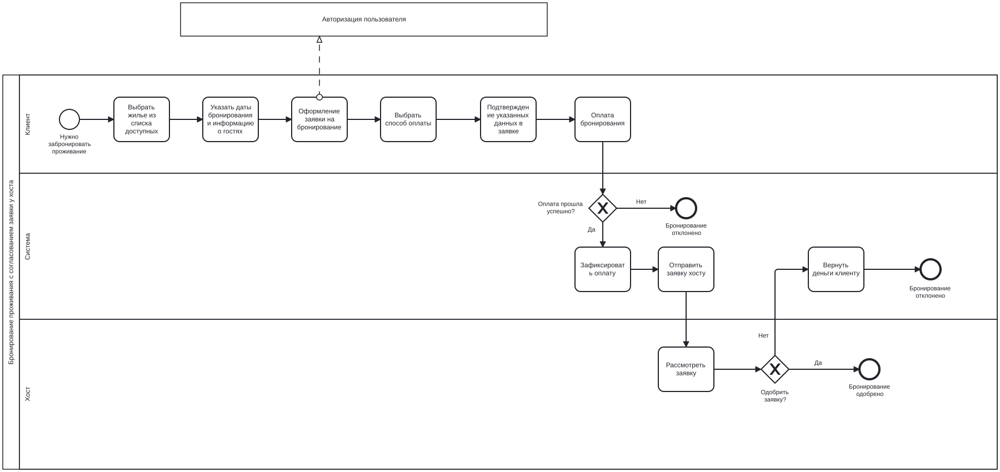

# БЛПС. Лабораторный курс

---

Группа:

- Кузьмин Артемий Андреевич
- Силинцев Владислав Витальевич

## Лабораторная работа 1

Вариант: 2606

Airbnb — жильё для отпуска, домики, пляжные дома и многое другое — [https://www.airbnb.ru/](https://www.airbnb.ru/). Бизнес-процесс: бронирование проживания с согласованием заявки у хоста.

Описать бизнес-процесс в соответствии с нотацией BPMN 2.0, после чего реализовать его в виде приложения на базе Spring Boot.

### Порядок выполнения работы

1. Выбрать один из бизнес-процессов, реализуемых сайтом из варианта задания.
2. Утвердить выбранный бизнес-процесс у преподавателя.
3. Специфицировать модель реализуемого бизнес-процесса в соответствии с требованиями **BPMN 2.0**.
4. Разработать приложение на базе **Spring Boot**, реализующее описанный на предыдущем шаге бизнес-процесс. Приложение должно использовать СУБД **PostgreSQL** для хранения данных, для всех публичных интерфейсов должны быть разработаны **REST API**.
5. Разработать набор curl-скриптов, либо набор запросов для REST клиента **Insomnia** для тестирования публичных интерфейсов разработанного программного модуля. Запросы Insomnia оформить в виде файла экспорта.
6. Развернуть разработанное приложение на сервере **helios**.

### Модель бизнес-процесса

### UML-диаграммы классов

### REST API

| Метод | URL | Описание |
| --- | --- | --- |
| POST | `/booking/{username}/require-housing/{id}` | Отправка запроса на бронирование жилья |
| GET | `/booking/{username}/recieved-requests` | Получение списка запросов на бронирование жилья, которым владеет пользователь |
| POST | `/booking/{username}/handle-request/{id}` | Обработать запрос на бронирование |
| GET | `/housing/all` | Список всего жилья, доступного для брони |
| POST | `housing/{username}/add-housing` | Запрос на регистрацию нового жилья. Чтобы оно стало доступным для бронирования, необходимо подтверждение модератора |

### Выводы

В ходе лабораторной работы был описан бизнес-процесс бронирования жилья с использованием нотации BPMN 2.0. На основе разработанной модели было реализовано серверное приложение на базе Spring Boot с использованием СУБД PostgreSQL и REST API для взаимодействия с системой.

## Лабораторная работа 2

Вариант: 9870

Доработать приложение из лабораторной работы №1, реализовав в нём управление транзакциями и разграничение доступа к операциям бизнес-логики в соответствии с заданной политикой доступа.

**Управление транзакциями необходимо реализовать следующим образом:**

- Переработать согласованные с преподавателем прецеденты (или по согласованию с ним разработать новые), объединив взаимозависимые операции в рамках транзакций.
- Управление транзакциями необходимо реализовать с помощью Spring JTA.
- В реализованных (или модифицированных) прецедентах необходимо использовать декларативное управление транзакциями.
- В качестве менеджера транзакций необходимо использовать Atomikos.

**Разграничение доступа к операциям необходимо реализовать следующим образом:**

- Разработать, специфицировать и согласовать с преподавателем набор привилегий, в соответствии с которыми будет разграничиваться доступ к операциям.
- Специфицировать и согласовать с преподавателем набор ролей, осуществляющих доступ к операциям бизнес-логики приложения.
- Реализовать разработанную модель разграничений доступа к операциям бизнес-логики на базе Spring Security + JAAS. Информацию об учётных записах пользователей необходимо сохранять в файле XML, для аутентификации использовать JWT.
